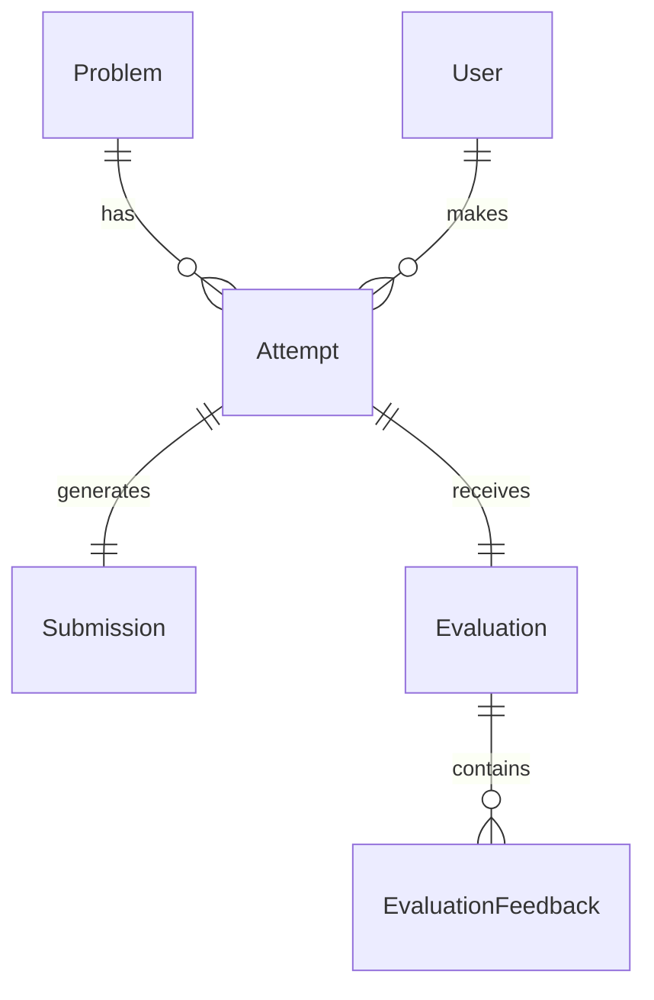

# DesignForge: Domain Model & Architecture

## 1. Product Overview
DesignForge is a specialized LLD practice platform where users read problem requirements, craft low-level architectural solutions (classes, relationships, patterns, explanations), and receive objective and qualitative feedback.

## 2. User Journey
1. **Discover:** User selects an LLD problem from the dashboard.
2. **Draft:** User designs a solution in a multi-pane workspace (saves as Draft).
3. **Submit:** User submits the attempt.
4. **Evaluate:** Engine processes submission deterministically (and via optional AI). 
5. **Review:** User views category scores, strengths, and targeted improvement suggestions.
6. **Retry:** User starts a new attempt applying feedback.

## 3. Architecture
The MVP relies on a simple monolithic architecture. 
- **Client (Frontend):** React (Vite, TypeScript, Tailwind CSS, shadcn/ui).
- **Server (Backend):** Node.js, Express, TypeScript.
- **Database:** SQLite with Prisma ORM.
- **Coupling & Cohesion:** Controller methods strictly coordinate requests, delegating core logic to Domain Services (e.g., `EvaluationEngine`).

## 4. Domain Model (Mermaid Diagram)


## 5. Important Classes / Interfaces

### A. Core Interfaces
To demonstrate strong LLD principles (Open/Closed, Dependency Inversion), we define major interfaces handling core logic capable of substitution:

```typescript
// 1. Evaluation Engine Interface
export interface EvaluationEngine {
    evaluate(problem: Problem, submission: ParsedSubmission): Promise<EvaluationResult>;
}

export interface EvaluationResult {
    overallScore: number;
    categories: EvaluationCategoryScore[];
    visualData?: any; // e.g., Mermaid relationships
}

export interface EvaluationCategoryScore {
    category: string;
    score: number;
    observation: string;
    whyItMatters: string;
    suggestion: string;
}

// 2. Parser Interface for multi-format submission support
export interface SubmissionParser {
    parse(content: unknown): ParsedSubmission;
}

export interface ParsedSubmission {
    classes: ClassMetadata[];
    relationships: RelationshipMetadata[];
    designPatternsMentioned: string[];
    rawText: string;
}
```

### B. Implementations
- **Evaluation Engines:**
  - `DeterministicEvaluationEngine`: Evaluates structural elements based on required models vs submitted classes. Focuses on base rules (e.g., entity coverage, simple relationship checks).
  - `AIEvaluationEngine` (Optional): Focuses on trade-offs, design choices, and semantic understanding.
  
- **Submission Parsers:**
  - `TextSubmissionParser`: Parses simple text block submissions containing pseudo-code / class definitions.
  - *Future:* `CodeSubmissionParser`, `DiagramSubmissionParser`.

## 6. State Transitions
`Attempt` entities progress through clear states:
- `DRAFT`: Actively being worked on, can be saved incrementally.
- `SUBMITTED`: Ready for evaluation.
- `EVALUATING`: Picked up by the evaluation engine.
- `COMPLETED`: Feedback ready to review.
- `FAILED`: Evaluation process encountered an error (allows retry evaluation).

## 7. Responsibilities 
- **Controllers:** HTTP coordination, request validation with Zod.
- **Services:** Application logic orchestrators (fetching problem, running evaluation engine, persisting results).
- **EvaluationEngine:** Only evaluates designs based on strict criteria; does not know about databases or HTTP.

## 8. Extensibility & Key Trade-offs
- **Monolith over Microservices:** Chose monolith to prevent operational overhead and remain within the 2-day evaluation limit. The codebase is organized by domain components.
- **Deterministic vs AI Feedback:** To bypass LLM dependency or timeout errors, deterministic evaluation operates as the primary feedback loop. The AI engine is seamlessly injected if available.
- **Extensible Parser:** We abstract how submission parsing works to easily plug in AST parsing or structural diagrams later without altering evaluation logic.
